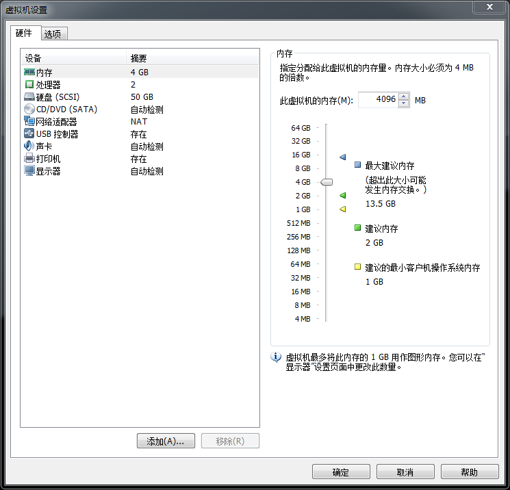
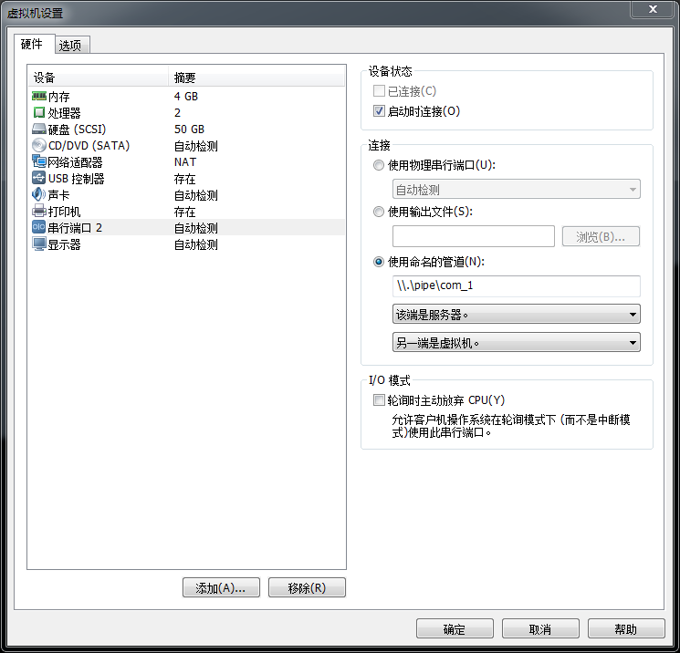
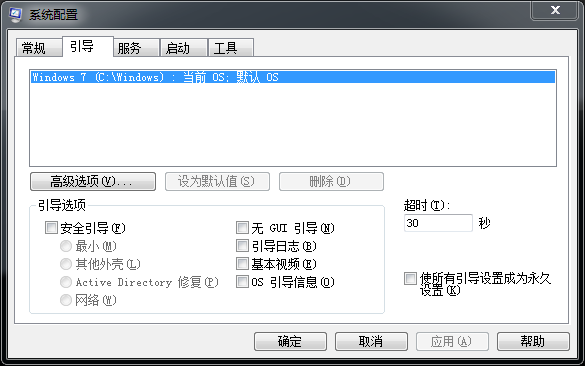
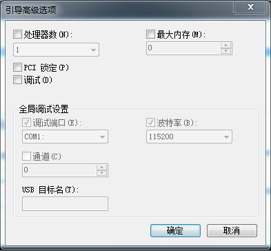
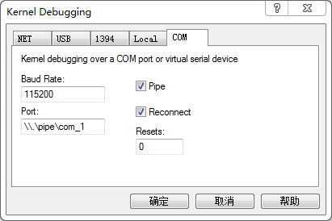
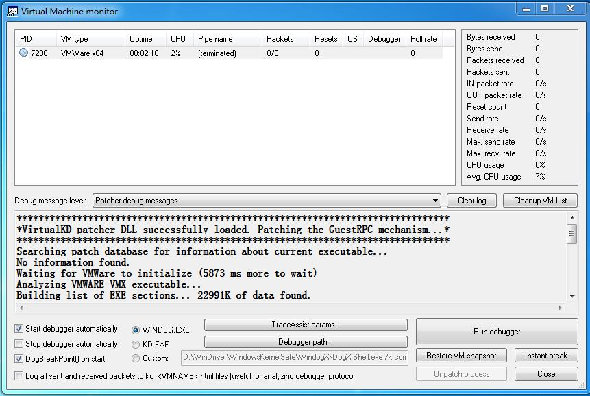
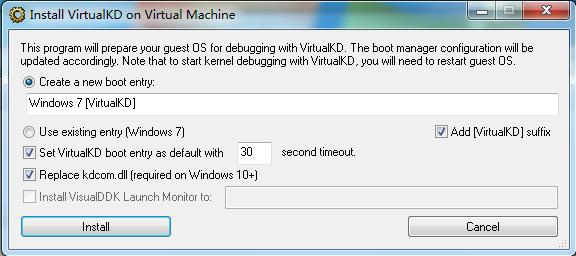

#驱动开发环境#

Windows驱动开发环境比应用程序开发要复杂一些，所需要的程序如下：

1. Visual Studio XXX
2. WDK
3. Windbg
4. 虚拟机软件（VMWare等）
5. 系统镜像（XP/Win7/Win10等）

开发环境首先需要编译环境，这里选择`Visual Studio`，它一方面可以方便程序编辑，另一方面可以进行驱动工程创建与编译（高版本的VS）。WDK是驱动开发必须的，就如同应用开发中的SDK一样。这两个不用多言，直接下载相应版本并且安装即可（注意WDK有和系统对应的版本限制，下载的WDK需要和开发机器的系统相匹配）。

程序开发中很重要的一部分是程序测试与调试，正常情况下可以在本机进行测试，但是由于驱动运行在Ring0，一旦出现错误很容易造成系统蓝屏，严重可能造成本机系统损坏，导致不必要的损失；如果要在实体机上进行调试，那就需要两台物理机器，这样成本比较大，并且如果驱动有问题也可能造成前面说的很多问题。所以安装虚拟机进行调试和测试是比较方便和明智的做法。安装了虚拟机可以使用双机调试的方式，用本机的Windbg调试虚拟机中的系统，进而也可以调试驱动程序。

关于上述软件的安装以及虚拟机中的系统安装都比较简单，这里不再详细说明。下面说一下双机调试环境如何建立。

###串口连接双机###

最基本的双机调试配置是用串口连接。以VMWare为例，在菜单中找`虚拟机`->`设置`，点击后如下，选择`硬件`选项卡。如下图所示，点击`添加`从列表中选择`串行端口`一直下一步即可。



如下图2，添加完串口后，还需要对窗口进行设置，在`连接`中单选按钮选择`使用命名管道`，并且给命名管道设置名字，一般设置为`\\.\pipe\com_1`一类的字符串（这个只是名字，其他名字也可）。



添加完虚拟机的串口，还需要对虚拟机中的系统进行调试设置。

对于XP/2003及其之前的系统没有专门的程序用于配置双击调试，需要直接配置系统盘（一般是C盘）下的`boot.ini`文件如下；

```
[boot loader]
timeout=30
default=multi(0)disk(0)rdisk(0)partition(1)\WINDOWS
[operating systems]
multi(0)disk(0)rdisk(0)partition(1)\WINDOWS="Microsoft Windows XP Professional" /noexecute=optin /fastdetect
multi(0)disk(0)rdisk(0)partition(1)\WINDOWS="Microsoft Windows XP Professional debug" /noexecute=optin /fastdetect /debug /debugport=com2 /baudrate=115200
```

其中最后一行为添加内容，即添加一条启动项，在启动时选择该启动项即可启动内核调试，这样主机中等待连接的Windbg就可以通过串口连接到该虚拟机中的内核。其中`Microsoft Windows XP Professional debug`为调试项名字，这个名字可改为其他易辨识的字符串。`/debug`表示开启内核调试，`/debugport=com2`表示调试端口使用什么接口连接（这个可以有串口，USB，1394，网络等），`/baudrate=115200`这个选项表示使用串口将波特率设置为`115200`。

> 注: `/debugport=com2`这一个选项：因为最新的VMWare中，COM1被默认提供给打印机共享使用，如果配置为COM1，调试器在链接时链接不上。此处使用COM2，在设置虚拟机添加COM端口时，也可以看到其实添加的为串行端口2。另外一个解决方法是将虚拟机的打印机设备删除掉，这样再添加串行端口即为COM1，在虚拟机中配置ini即可设置为`/debugport=com1`。

对于Win7及其之后的系统则有两种方法可以设置。一种是使用命令行程序`bcdedit`进行配置，还有一种是使用界面程序`msconfig`配置。

用于配置双机调试的`bcdedit`命令选项如下所示：

```
bcdedit /?      				// 查看帮助
bcdedit /enum OSLOADER          // 枚举所有的加载器
bcdedit /copy {current} /d "Windows 7 Debug"
bcdedit /debug XXX ON
bcdedit /bootdebug XXX ON
bcdedit /dbgsetting     		// 设置调试配置  波特率等
bcdedit /timeout 7 			 // 设置超时时间
```

配置双机调试的一个示例如下：

```
1. 以管理员身份运行cmd
2. 在命令提示行中输入如下命令复制开机启动项：
	bcdedit /copy {current} /d "Win for debug"      复制当前开机启动项，复制项目的描述为"for debug"。（描述显示为引导菜单标题）
3、记录下返回标识，便于编辑:
	本例中，返回的GUID为：{edc961e6-0a37-11df-a30a-92cc1b2fa135}
4、在命令提示行中输入如下命令，启用复制项系统加载器的启动调试
	bcdedit /bootdebug {edc961e6-0a37-11df-a30a-92cc1b2fa135} ON
5、在命令提示行中输入如下命令设置全局调试程序在com1上以115200波特进行串行调试：
	bcdedit /dbgsettings SERIAL DEBUGPORT:1 BAUDRATE:115200
6、在命令行中输入如下命令启用内核调试
	bcdedit /debug {edc961e6-0a37-11df-a30a-92cc1b2fa135} ON
```

图形化的界面操作可以按照如下步骤：

```
1. WIN+R 打开运行输入msconfig打开启动配置对话框设置调试，如图2所示。
2. 选择"引导"标签，点击"高级选项"按钮，弹出高级设置，如图3所示。
3. 勾选"调试"复选框，"全局调试设置"组内的内容即可编辑。
4. 选择调试端口，波特率即可。
```





在开启虚拟机后，启动Windbg，并选择菜单`File`->`Kernel Debug`，弹出窗口选择`COM`标签，如下所示。填写波特率和串口名称（即设置VMWare串口时设置的名称）。



点击`确定`按钮后Windbg即进入等待串口连接，启动虚拟机中待调试系统即可。

###使用VirtualKD###

上一节中可以看到，直接配置Windbg双机调试还是比较麻烦的，同时还会有性能问题，导致双机数据传输非常慢，有一个工具专门用于配置双机调试——VirtualKD。`VirtualKD`工具可以免去Windbg双机调试的琐碎配置，并且极大提高双机调试时的响应速度。

`VirtualKD`是开源的程序，可以从`VirtualKD`的主页（[http://virtualkd.sysprogs.org/](http://virtualkd.sysprogs.org/)）下载。

`VirtualKD`程序是自减压程序，直接放到指定目录即可。其中包含了`vmmon.exe`和`vmmon64.exe`，它们是虚拟机的监视器，分别用于X86和X64系统上。启动它们后可以看到当前有几个虚拟机在运行，



点击`Debugger path...`按钮可以选择Windbg的路径，对于不是安装包安装的Windbg可能需要使用它选择一下目录。

在`VirtualKD`的安装目录中包含一个`target`目录，将`target`目录放到虚拟机的系统中，并运行其中程序。如下图所示，默认选项，直接点击`Install`即可。其中`Windows 7[VirtualKD]`为添加的启动项，这个名称可修改。



然后提示重启，重启时选择前面的调试启动项即可。这样在系统启动时`VirtualKD`会自动将Windbg启动起来，接下来就可以正常使用Windbg调试虚拟机中的系统了。

> 注：在使用VMWare时，安装完虚拟机中的系统之后，一方面要安装虚拟机工具`VMWare Tools`，另一方面如前面所述，虚拟机默认添加打印机设备，虚拟机中系统的串口1被占用了，这样会导致`VirtualKD`配置出问题。防止配置出问题再修改，在安装完虚拟机时就从虚拟机设置中将打印机设备删除掉，这样就空出来串口1了。

有时候添加的调试启动项不生效，启动了`VMMon.exe`也无法启动Windbg，链接虚拟机系统进行调试，可以尝试删除启动项，从新添加一项。删除启动项可以从`msconfig`程序（`Win+R`运行）的引导标签页中删除不想要的启动项。

**参考文章**

1. [驱动开发入门 – 之一：Win7 SP1 x64 驱动开发环境搭建](http://exp-blog.com/2018/07/26/pid-2137/)
2. [驱动开发入门 – 之二：双机调试环境搭建](http://exp-blog.com/2018/07/26/pid-2146/)
3. [Windows内核安全编程实践之路](https://www.kanxue.com/book-30-226.htm)

By Andy@2018-11-12 20:09:23
