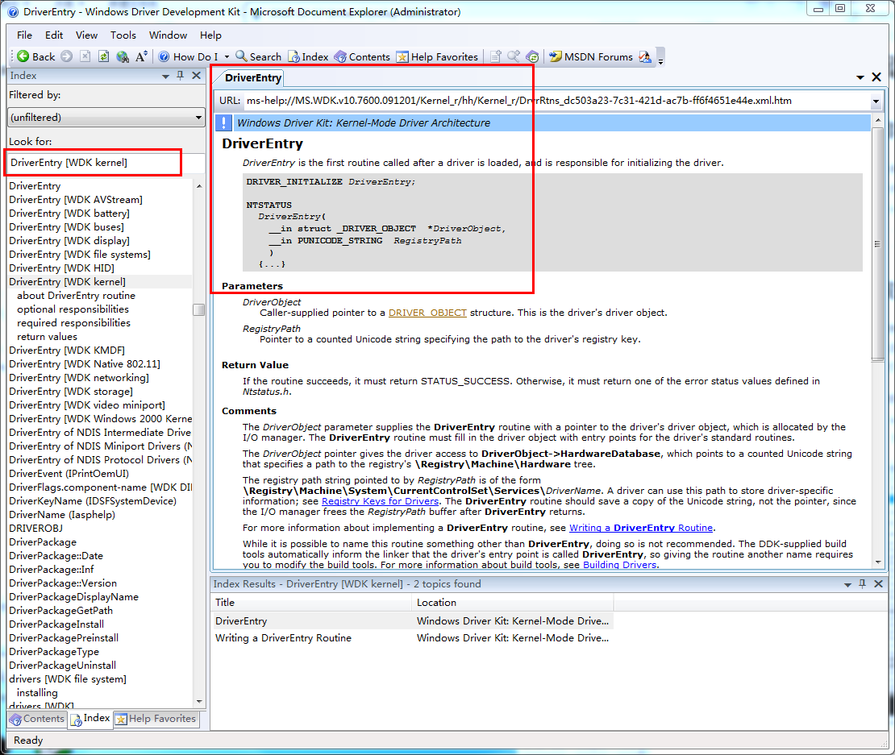

#驱动编程中的技巧#

###函数与类型查找###

WDK安装过程中会安装驱动编程的文档，这是微软提供的官方文档，所有的类型以及函数说明最终都要以它为准。所以有一些内容与其从网上或搜索引擎搜索，不如从这里查找。如下搜索驱动的入口函数`DriverEntry`，如图1所示。

当然了，微软的官方文档描述模糊，一些原理性内容写的罗哩罗嗦也是公认的问题，读不明白文档还是要去浩瀚的互联网上寻求大众的智慧^_^。

###内核支持函数搜索###

有时候有些函数只知道部分字段，但是想不起来完整的函数名字。或者说想要看看内核到底支持不支持想要实现的功能，可能用的比较多的是字符串处理。有时候盲目去搜索引擎搜索，可能会词不达意，导致搜索不到。其实内核编程中用的比较多的就是内核自身的导出函数，从其中搜索会更有针对性。

以最常用的内核模块`ntoskrnl.exe`为例，用`IDA`反编译内核模块`C:\Windows\System32\ntoskrnl.exe`模块，然后再`Exports`标签中搜索关键字即可找到对应的导出函数。比如查找`UNICODESTRING`相关的操作函数，如下图2。

###内核支持函数搜索###

By Andy@2018-11-17 12:14:32