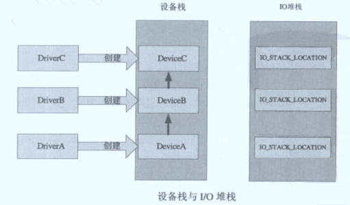

# 驱动分层与过滤驱动 #

### 驱动分层 ###

无论NT式驱动还是WDM式驱动都可以设计成分层驱动。分层设计可以将功能复杂的驱动分解为多个简单的驱动程序。

分层驱动的概念主要为了区分前面介绍的单层驱动程序，分层驱动指两个或两个以上的驱动程序，它们分别创建对象，并形成一个由高到低的设备对象栈。IRP请求一般会被传送到设备栈最顶层的对象，然后由各层设备对象依次处理IRP，并层层向下传递；当IRP在某层设备对象中被完成时，IRP会顺着设备栈的反方向原路返回。

设备栈是通过设备挂载形成的，`IoAttachDeviceToDeviceStack`函数用于将一个设备对象挂到对应的设备对象上，从形成设备栈。设备对象数据结构体中`DriverObject`指向本设备对象对应的驱动对象；`NextDevice`为本设备对象所属驱动所创建的所有的设备对象链；`AttachedDevice`指向自己被那个设备对象挂载了，即在自己高层的某个设备（并不一定是临近的高层设备对象）。

这里其实还有一个变量常用，即挂接到设备栈之后，自己的下层是那个设备对象。这个值通常是由挂接函数返回，它可以被保存到设备对象扩展中（需要自己定义）。

> `IoDetacchDevice()`函数用于将当前设备对象从目标设备栈上摘除。

与设备栈相关联的一个概念是`I/O`堆栈，即`IO_STACK_LOCATION`结构表示。如下图为设备栈和IRP的`I/O`栈的对应图。



转发IRP时需要用到两个宏定义`IoSkipCurrentIrpStackLocation()`和`IoCopyCurrentIrpStackLocationToNext()`，它们分别用于本层设备对象不需要使用`I/O`堆栈和本层设备对象使用了IRP的`I/O`堆栈的情况。

关于IRP转发与处理可以参考前面的例子。

**完成例程**

完成例程是设置到IRP上的，在IRP被完成回溯时，调用到当前层的`I/O`栈时会调用所设置的完成例程。

`IoSetCompletionRoutine()`宏定义用于设置IRP的完成例程。完成例程有两种返回状态，`STATUS_SUCESS`或`STATUS_CONTINUE_COMPLETION`是等价的，表示驱动不再得到IRP的控制。另一种`STATUS_MORE_PROCESSING_REQUIERD`则表示本层设备堆栈会重新获得IRP控制权，并且设备栈不会继续向上回卷，此时如果处理了IRP后，则需要再次将它完成。

**传播Pending位**

当底层设备完成了IRP后，底层堆栈的Control域的`SL_PENDING_RETURNED`位必须被传播到上一层。如果本层没有设置完成例程，那么这种传播自动完成，不需要程序员指定。如果本层堆栈设置了完成例程，则这种传播需要程序员自己实现。

那么就需要在完成例程中进行设置，如下代码块所示。

```
NTSTATUS CompleteRoutine(...)
{
	if(Irp->PendingReturned)
    {
    	IoMarkIrpPending(Irp);
    }

    return STATUS_CONTINUE_COMPLETION;
}
```

### 过滤驱动 ###

WDM过滤驱动程序有两种，一种是高层过滤驱动，一种低层过滤驱动程序，分别位于功能设备对象的上层和下层。

WDM过滤驱动需要修改要挂载驱动的注册表信息来添加高层或低层过滤驱动。具体参考《Windows驱动开发技术详解》。

NT式的过滤驱动则不需要修改注册表，它是通过驱动名直接寻找需要过滤的驱动设备的指针，然后自己挂载上去。下面以键盘的过滤驱动为例看一下如何使用NT式过滤驱动程序。

在驱动加载入口中，通过键盘驱动设备对象名字`\\Device\\Kbdclass`获取到设备驱动对象指针，然后创建过滤驱动设备对象，并将驱动对象挂到键盘驱动设备对象上。设置新创建的设备对象属性与挂载到的设备对象一致。

虽然是NT式过滤驱动，但是它还是要处理PNP，将其直接转发到下层设备驱动。除了读取的IRP派遣函数，其他的派遣函数则一律设置为IRP转发。

当过滤驱动的读取派遣函数接到读取的IRP时，则给IRP设置完成函数，当底层读取完键盘内容后，在完成函数中实现对读取值的修改，然后将IRP继续回溯。

驱动卸载时有一些需要注意的事项，当卸载了驱动之后，并不能马上返回，还需要等待曾经设置过完成例程的IRP完成，否则如果驱动卸载，设置的完成例程被调用时会出现错误。

```
#include <wdm.h>
#include <ntddkbd.h>

extern POBJECT_TYPE* IoDriverObjectType;

#define KTD_NAME L"\\Device\\Kbdclass"

//键盘计数，用于标记是否irp完成
ULONG KS_KeyCount;

NTSTATUS 
ObReferenceObjectByName(
	IN PUNICODE_STRING ObjectName,
	IN ULONG Attributes,
	IN PACCESS_STATE PassedAccessState,
	IN ACCESS_MASK DesiredAccess,
	IN POBJECT_TYPE ObjectType,
	IN KPROCESSOR_MODE AccessMode,
	IN OUT PVOID ParseContext,
	OUT PVOID *Object
);

typedef struct _Dev_exten
{
	ULONG size;

	PDEVICE_OBJECT filterdevice;
	PDEVICE_OBJECT targetdevice;
	PDEVICE_OBJECT lowdevice;

	KSPIN_LOCK IoRequestsSpinLock;

	KEVENT IoInProgressEvent;

}DEV_EXTEN, *PDEV_EXTEN;

NTSTATUS entrydevices(PDEV_EXTEN devext, PDEVICE_OBJECT filterdevice, PDEVICE_OBJECT targetdevice, PDEVICE_OBJECT lowdevice)
{
	memset(devext, 0, sizeof(DEV_EXTEN));
	devext->filterdevice = filterdevice;
	devext->targetdevice = targetdevice;
	devext->lowdevice = lowdevice;
	devext->size = sizeof(DEV_EXTEN);
	KeInitializeSpinLock(&devext->IoRequestsSpinLock);
	KeInitializeEvent(&devext->IoInProgressEvent, NotificationEvent, FALSE);
	return STATUS_SUCCESS;
}

NTSTATUS attachDevice(PDRIVER_OBJECT driver, PUNICODE_STRING reg_path)
{
	NTSTATUS status;

	UNREFERENCED_PARAMETER(reg_path);

	UNICODE_STRING kbdname = RTL_CONSTANT_STRING(L"\\Driver\\Kbdclass");
	PDEV_EXTEN drvext;
	PDEVICE_OBJECT filterdevice;
	PDEVICE_OBJECT targetdevice;
	PDEVICE_OBJECT lowdevice;
	PDRIVER_OBJECT kbddriver;

	status = ObReferenceObjectByName(&kbdname, OBJ_CASE_INSENSITIVE, NULL, 0, *IoDriverObjectType, KernelMode, NULL, &kbddriver);
	if (!NT_SUCCESS(status))
	{
		KdPrint(("Open driver failed\n"));
		return status;
	}
	else
	{
		ObDereferenceObject(kbddriver);
	}

	targetdevice = kbddriver->DeviceObject;
	while (targetdevice)
	{
		status = IoCreateDevice(driver, sizeof(DEV_EXTEN), NULL, targetdevice->DeviceType, targetdevice->Characteristics, FALSE, &filterdevice);
		if (!NT_SUCCESS(status))
		{
			KdPrint(("create device failed\n"));
			filterdevice = NULL;
			targetdevice = NULL;
			return status;
		}
		lowdevice = IoAttachDeviceToDeviceStack(filterdevice, targetdevice);
		if (!lowdevice)
		{
			KdPrint(("Attach Failed\n"));
			filterdevice = NULL;
		}

		drvext = (PDEV_EXTEN)filterdevice->DeviceExtension;
		entrydevices(drvext, filterdevice, targetdevice, lowdevice);
		filterdevice->DeviceType = lowdevice->DeviceType;
		filterdevice->Characteristics = lowdevice->Characteristics;
		filterdevice->StackSize = lowdevice->StackSize + 1;
		filterdevice->Flags |= lowdevice->Flags & (DO_BUFFERED_IO | DO_DIRECT_IO | DO_POWER_PAGABLE);
		targetdevice = targetdevice->NextDevice;
	}
	KdPrint(("create and attach finished.\n"));
	return STATUS_SUCCESS;
}

NTSTATUS mydispatch(PDEVICE_OBJECT pdevice, PIRP pIrp)
{
	NTSTATUS status;
	KdPrint(("go to lowdevice\n"));
	PDEV_EXTEN devext = (PDEV_EXTEN)pdevice->DeviceExtension;
	PDEVICE_OBJECT lowdevice = devext->lowdevice;
	IoSkipCurrentIrpStackLocation(pIrp);
	status = IoCallDriver(lowdevice, pIrp);
	return status;
}

NTSTATUS mypowerpatch(PDEVICE_OBJECT pdevice, PIRP pIrp)
{
	NTSTATUS status;
	KdPrint(("go to power\n"));
	PDEV_EXTEN devext = (PDEV_EXTEN)pdevice->DeviceExtension;
	PDEVICE_OBJECT lowdevice = devext->lowdevice;
	status = IoCallDriver(lowdevice, pIrp);

	return status;
}

NTSTATUS mypnppatch(PDEVICE_OBJECT pdevice, PIRP pIrp)
{
	NTSTATUS status;
	KdPrint(("go to pnp\n"));
	PDEV_EXTEN devext = (PDEV_EXTEN)pdevice->DeviceExtension;
	PDEVICE_OBJECT lowdevice = devext->lowdevice;
	PIO_STACK_LOCATION stack = IoGetCurrentIrpStackLocation(pIrp);
	switch (stack->MinorFunction)
	{
	case IRP_MN_REMOVE_DEVICE:
	{
		IoSkipCurrentIrpStackLocation(pIrp);
		IoCallDriver(lowdevice, pIrp);
		IoDetachDevice(lowdevice);
		IoDeleteDevice(pdevice);
		status = STATUS_SUCCESS;
		break;
	}
	default:
		IoSkipCurrentIrpStackLocation(pIrp);
		status = IoCallDriver(lowdevice, pIrp);
		break;
	}
	return status;
}

NTSTATUS myreadcomplete(PDEVICE_OBJECT pdevice, PIRP pIrp, PVOID Context)
{
	UNREFERENCED_PARAMETER(pdevice);
	UNREFERENCED_PARAMETER(Context);

	PIO_STACK_LOCATION stack;
	ULONG keys;
	PKEYBOARD_INPUT_DATA mydata;
	stack = IoGetCurrentIrpStackLocation(pIrp);
	if (NT_SUCCESS(pIrp->IoStatus.Status))
	{
		mydata = pIrp->AssociatedIrp.SystemBuffer;
		keys = pIrp->IoStatus.Information / sizeof(KEYBOARD_INPUT_DATA);
		for (ULONG i = 0; i < keys; i++)
		{
			KdPrint(("numkeys: %d\n", keys));
			KdPrint(("samcode: %d\n", mydata->MakeCode));
			KdPrint(("%s\n", mydata->Flags ? "Up" : "Down"));
			if (mydata->MakeCode == 0x1F)   // 修改内容
			{
				mydata->MakeCode = 0x20;
			}
			mydata++;
		}
	}

	KS_KeyCount--;
	if (pIrp->PendingReturned)
	{
		IoMarkIrpPending(pIrp);
	}
	return pIrp->IoStatus.Status;
}

NTSTATUS ReadDispatch(PDEVICE_OBJECT pDevice, PIRP pIrp)
{
	NTSTATUS status = STATUS_SUCCESS;

	PDEV_EXTEN devExt;
	PDEVICE_OBJECT lowDevice;
	PIO_STACK_LOCATION stack;

	if (pIrp->CurrentLocation == 1)
	{
		KdPrint(("irp send error..\n"));
		status = STATUS_INVALID_DEVICE_REQUEST;
		pIrp->IoStatus.Status = status;
		pIrp->IoStatus.Information = 0;
		IoCompleteRequest(pIrp, IO_NO_INCREMENT);
		return status;
	}

	devExt = pDevice->DeviceExtension;
	lowDevice = devExt->lowdevice;
	stack = IoGetCurrentIrpStackLocation(pIrp);

	KS_KeyCount++;
	IoCopyCurrentIrpStackLocationToNext(pIrp);
	IoSetCompletionRoutine(pIrp, myreadcomplete, pDevice, TRUE, TRUE, TRUE);
	status = IoCallDriver(lowDevice, pIrp);
	return status;
}

NTSTATUS dettach(PDEVICE_OBJECT pdevice)
{
	PDEV_EXTEN devext = (PDEV_EXTEN)pdevice->DeviceExtension;
	IoDetachDevice(devext->targetdevice);
	devext->targetdevice = NULL;
	IoDeleteDevice(pdevice);
	devext->filterdevice = NULL;
	return STATUS_SUCCESS;
}

NTSTATUS DriverUnload(PDRIVER_OBJECT driver)
{
	PDEVICE_OBJECT pdevice;
	pdevice = driver->DeviceObject;

	while (pdevice)
	{
		dettach(pdevice);
		pdevice = pdevice->NextDevice;
	}

	LARGE_INTEGER KS_Delay;
	KS_Delay = RtlConvertLongToLargeInteger(-10 * 3000000);
	while (KS_KeyCount)
	{
		KeDelayExecutionThread(KernelMode, FALSE, &KS_Delay);
	}
	KdPrint(("driver is unloading...\n"));
	return STATUS_SUCCESS;
}

NTSTATUS DriverEntry(PDRIVER_OBJECT driver, PUNICODE_STRING reg_path)
{
	ULONG i;
	NTSTATUS status;

	for (i = 0; i < IRP_MJ_MAXIMUM_FUNCTION; i++)
	{
		driver->MajorFunction[i] = mydispatch;
	}

	driver->MajorFunction[IRP_MJ_READ] = ReadDispatch;
	driver->MajorFunction[IRP_MJ_POWER] = mypowerpatch;
	driver->MajorFunction[IRP_MJ_PNP] = mypnppatch;

	KdPrint(("driver entry\n"));
	driver->DriverUnload = DriverUnload;
	status = attachDevice(driver, reg_path);

	return STATUS_SUCCESS;
}
```

By Andy@2019-02-24 16:44:32