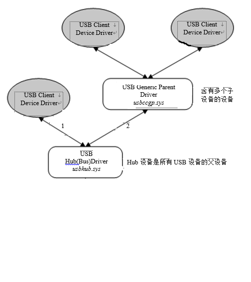
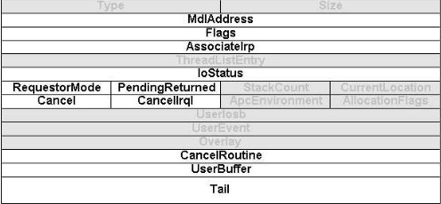
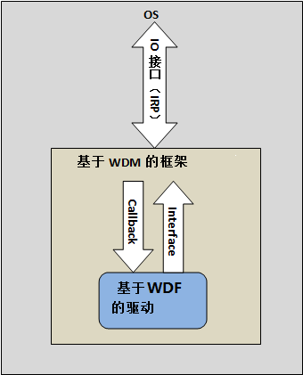

#Windows驱动#

在总结Windows驱动其他内容之前，先得明白一个简单问题 —— 什么是驱动？简单说，驱动是内核的扩展程序。

提到Windows驱动，那么就会遇到Windows驱动框架。框架，它定义了一件事情的边界或范围。驱动框架即定义了如何和内核进行交互，获取内核支持，和硬件交互的方法等。

###驱动框架历史###

* 在Windows 9x系统上，使用VxD驱动框架。VxD并非同一接口框架，`x`代表不同的设备。它虚拟底层物理设备，供系统内核使用。
* NT系统上提供了NT使用的驱动框架，即`NT驱动框架`
* NT驱动框架扩展后，增加了PNP和Power功能支持，就形成了WMD（Windows Driver Model）
* Vista上则又发布了扩展WDM框架的WDF框架（Windows Driver Foundation）

###WDM框架###

WDM框架是一个分层的驱动模型，多个驱动可以构成驱动栈。驱动栈一般由底层的总线驱动和上层的功能驱动构成。在驱动栈上可以插入若干过滤驱动，增强功能。

总线驱动，负责对设备的枚举，获取设备接入通知，与物理设备通信与交互等。功能驱动，不与硬件设备通信，集中于实现设备内部的功能。

一个典型的设备栈如图下所示：


分层模型可以进行演化，即一个设备即是功能驱动又是总线驱动。

USB设备即有

驱动栈表示的是软件层的概念，每一层驱动栈代表一个驱动程序；而每一层驱动栈可以驱动多个设备，即一个驱动程序可以管理多个设备。每一个设备是由驱动程序内部的设备对象来管理。

这是就引入了设备栈（Device Stack）的概念，编程中设备栈用的较广泛。总线驱动创建的是物理设备对象（Physical Device Object，PDO），功能驱动创建的功能设备对象（Function Device Object，FDO）。如果有过滤驱动，它创建的是过滤设备对象。如下图，`USB Hub`驱动具有两个子设备，它则需要创建两个不同设备对象，分别管理两个子设备。




WDM框架定义了统一的`I/O`接口，即IRP（`I/O` Request Pocket），所有和系统的交互被封装在IRP包中。

系统和驱动的交互有28种，即IRP类型由预先定义的一个整数指定，这些整数被定义为`IRP_MJ_XXX`，比如`IRP_MJ_CREATE0`。

IRP结构体定义比较复杂，是按照`IRP头 + I/O栈`组成。IRP头结构如下图所示：



**Type**:

**Size**: IRP的大小。

**MdlAddress**: 设备执行`I/O`时，指向用户空间的内存描述表。

**Flags**: 对驱动程序只读的标志，与WDM驱动程序无关。

**AssociateIrp**: 它的一个成员SystemBuffer指针指向一个数据缓存区。该缓冲区位于非分页内存中，`I/O`管理器把用户模式程序发送给驱动程序复制到这个缓冲区。对于读请求，设备驱动程序把读出的数据填到这个缓冲区，然后`I/O`管理器再把缓冲区的内容复制到用户缓冲区。

**IoStatus**: 是一个结构体`IRP-Header-Struct`，结构体包含两个域。`IoStatus.Status`保存执行结果的NTSTATUS码，`IoStatus.Information`的类型为`ULONG_PTR`，它将收到一个信息只。该值含义取决于具体的IRP类型和请求完成的状态。

`I/O`栈是个什么东西呢？IRP被驱动程序处理，而驱动程序以栈形式串联，即IRP会被多个驱动程序处理。同一个东西被多个对象处理，为了防止数据篡改和混乱，则为每一个对象创建一个空间，这就对应到`I/O`栈。为每一个对象创建一个独立的空间，`I/O`栈就对应了设备栈。IRP在设备栈流转时，设备对象则需要获取自己对应的`I/O`栈上的空间。设备栈上的元素是固定大小，但是设备栈的层数是不定的。

WDM支持PnP和电源。PnP即Plug aNd Play简称，代表和外部设备插线有关的处理。PNP是现代操作系统必须支持的基本特性，其目的是希望操作系统能够在软硬件支援下，在基本无需用户干预的情况下，即可很好地处理外部设备的接入和移除操作。例如USB设备，只需插入USB设备，系统自动识别然后加载。

电源也是类似的，要支持`PnP`，则必须支持电源，这是因为设备接入和拆除则需要设备的上电和断电。最终目的是达到：系统和设备可以在这些电源状态之间进行切换，并达到正常情况下全力供电，空闲情况下尽量省电的目的。


内核驱动使用中断级，实现实时性。`PASSIVE_LEVEL`用于程序和大部分驱动程序的运行级别；`APC_LEVEL`支持APC的优先级；`DISPATCH_LEVEL`分发级别，比如线程切换。

###WDF框架###

之所以要引入WDF框架，主要是因为WDM框架编程非常复杂。一个例子是`PnP`和`Power`是最基本的功能，但是要完好支持需要考虑几百个不同的Case；另外一个例子是IRP的处理比较复杂，比如设备驱动处理IRP过程中，如果设备拆除，则需要取消`I/O`操作，这个是非常复杂的操作，需要几百行代码。

WDF是基于WDM框架做了封装，导出新的接口，封装了PnP与电源的处理逻辑。WDF分为KMDF和UMDF两个子框架，UMDF支持用户模式驱动。

如下图为WDF框架的示意图，WDF框架基于WDM框架。



###驱动示例###

`DriverEntry`是内核驱动入口函数，它的声明如下：

```
NT_STATUS
DriverEntry(
	PDRIVER_OBJECT,
    PUNICODE_STRING
)
{
	...
	return STATUS_SUCCESS;
}
```

第一个参数是驱动对象指针，即在调用驱动程序入口时，系统已经为该驱动创建了一个驱动对象，代表该驱动模块；第二个参数为一个字符串，驱动程序在注册表中服务键下的完整路径。返回状态值表示驱动程序是否要被继续加载。如果返回`STATUS_SUCCESS`则系统继续调用其他初始化函数；返回其他值则系统认为出现错误，不再加载驱动。

如下为第一个参数的指向的内容：

```
typedef struct _DRIVER_OBJECT {
    CSHORT Type;                        //驱动程序的类型
    CSHORT Size;                        //驱动对象结构体的大小
    PDEVICE_OBJECT DeviceObject;        //指向驱动程序创建的设备对象,这些设备对象构成一个链表
    ULONG Flags;                        //驱动程序标志
    PVOID DriverStart;                  //驱动程序映像的起始地址
    ULONG DriverSize;                   //驱动程序映像的大小
    PVOID DriverSection;                //指向驱动程序映像的内存区对象,可以通过该成员遍历系统中所有的驱动模块
    PDRIVER_EXTENSION DriverExtension;  //指向驱动程序对象的扩展结构
    UNICODE_STRING DriverName;          //驱动的名称
    PUNICODE_STRING HardwareDatabase;   //设备的硬件数据库名,一般为HKEY_LOCAL_MACHINE\Hardware\DESCRIPTION\System
    PFAST_IO_DISPATCH FastIoDispatch;   //指向文件系统以及网络传输驱动会用到的派遣函数的指针表
    PDRIVER_INITIALIZE DriverInit;      //并不指向DriverEntry函数，这是IO管理器设置的，一种可能是GsDriverEntry
    PDRIVER_STARTIO DriverStartIo;      //记录StartIO例程的函数地址,用于串行化操作.
    PDRIVER_UNLOAD DriverUnload;        //指向驱动卸载时所用的回调函数地址
    PDRIVER_DISPATCH MajorFunction[IRP_MJ_MAXIMUM_FUNCTION + 1]; //指向驱动程序的派遣函数地址表
} DRIVER_OBJECT,*PDRIVER_OBJECT;
```

在`DriverEntry`中必须要做的就是初始化驱动对象，即驱动对象的函数指针。IRP所有种类都对应了处理函数，这个映射关系就位于驱动对象中，这里初始化的就是这个函数列表。其实这个函数列表就是`DriverObject.MajorFunction[IRP_MJ_MAXIMUM_FUNCTION+1]`。

在驱动程序中，除了物理设备对象，功能设备对象，过滤设备对象之外，还有就是控制设备对象，它用于与用户程序交互，或与其他的设备交互。如果要与用户程序交互，则还需要创建符号链接。

用户程序通过文件方式操作驱动对象，符号链接就是它在用户空间的代表。使用的函数包括`CreateFile`，`ReadFile`，`WriteFile`，`CloseHandle`等。

By Andy @2018-06-27 14:29:32